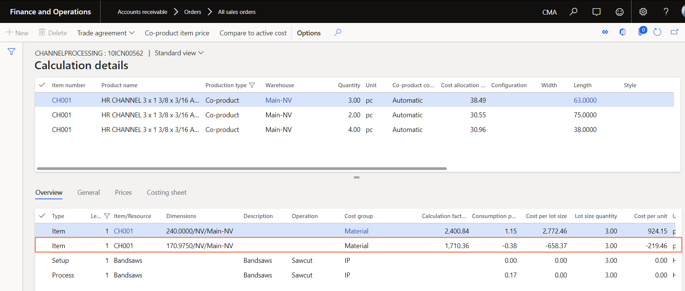
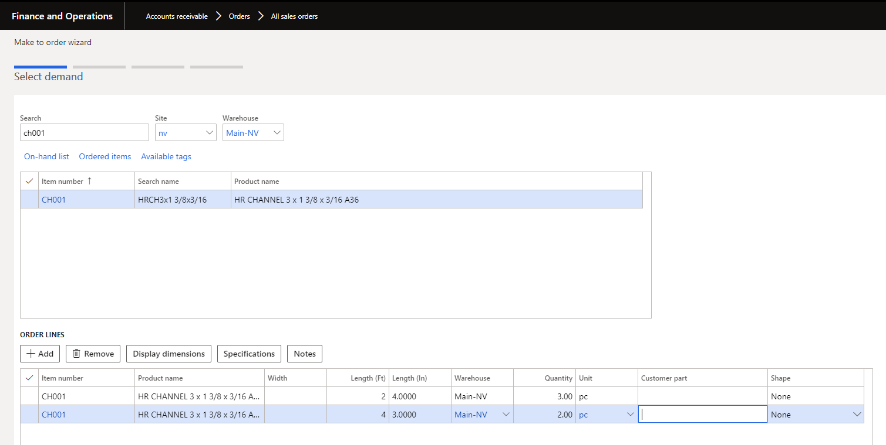

# FD\_25734\_ Remnant devaluation table

Functional Design

FD\_25734\_ Remnant devaluation table

## Document Owners

CROWE

**Vaibhav Bansal**

## Document Status

Crowe Metal Accelerator

| Version | Description | Owner\(s\) | Date |
| :--- | :--- | :--- | :--- |
| 1.0 | Initial draft | Vaibhav Bansal | 09/16/20 |
| 2.0 | Update remnant devaluation parameter and condition to compare exiting cost with remnant devaluation cost | Vaibhav Bansal | 10/8/20 |

## Table of Contents

[Document Owners 2](https://iconnect/teams/perf/MDenterprisesolutions/CMA/CMA%20Documents/FD_25734_%20Remnant%20devaluation%20table.docx#_Toc53090651)

[Document Status 2](https://iconnect/teams/perf/MDenterprisesolutions/CMA/CMA%20Documents/FD_25734_%20Remnant%20devaluation%20table.docx#_Toc53090652)

[Table of Contents 3]()

[1. Introduction 4]()

[1.1. Overview of Proposed Solution 4]()

[1.2. Business Requirements 4]()

[2. Justification 5]()

[2.1. Current Functionality 5]()

[2.2. Workarounds Considered 5]()

[2.3. Alternative Enhancements Considered 5]()

[2.4. Enhancement Benefits 5]()

[3. Detailed Design Specifications 6]()

[3.1. Remnant devaluation parameter 6]()

[3.2. Remnant devaluation table 7]()

[3.2.1. Data entity for remnant devaluation table 8]()

[3.3. Remnant devaluation cost calculation logic 9]()

[3.4. Form list using remnant devaluation table to update remnant cost 10]()

[3.4.1. Make to order wizard bom calculation 10]()

[3.4.2. Production order cost estimation 12]()

[3.4.3. Update the return to stock cost at the report as finished job 14]()

[3.4.4. Update the return to stock cost at picking list posting 17]()

[4. Security 19]()

[5. Data Migration 20]()

[6. Assumptions 21]()

[6.1. Configuration 21]()

[6.2. Cross-Functional Implications 21]()

[7. Scenarios & Examples 22]()

[7.1. Make to order return to stock cost as per the remnant devaluation cost 22]()

## Introduction

### Overview of Proposed Solution

This enhancement provides the ability to assign returns to stock a unit cost price based on the remnant devaluation table when it is generated from make to order wizard \(sales order & sales quotation\) or from cut plan workbench. Instead of valuing returns to the stock based on the cost of the parent tag, the cost price assignment will be governed by attribute-based rules in a pre-defined setup table. Remnant devaluation cost price is used in cost estimation routines and at the time of reporting a return to stock into inventory.

### Business Requirements

| ID | Description |
| :--- | :--- |
|  | Ability to set up and maintain a remnant devaluation table where return to stock costs can be defined based on product attributes including form/shape, condition, thickness range, width range, length range |
|  | Ability to maintain the current costing logic for returns to the stock of standard sizes, where the remnant is valued at the same unit cost as the parent tag |
|  | Ability to factor remnant devaluation table into bom calculation from the MTO wizard |
|  | Ability to factor remnant devaluation table into bom calculation from production order estimation |
|  | Ability to factor remnant devaluation table into the assignment of the cost price for a return to stock entered at the report as finish |
|  | Ability to factor remnant devaluation table into the assignment of the cost price for a return to stock entered directly in a picking list |
|  | Ability to factor remnant devaluation table into a return to stocks entered with remnant attachments \(dog leg\) |
|  | Ability to factor remnant devaluation table into bom calc triggered when advanced cost allocation logic is run to factor in processing time vs. material cost for plate burning |

## Justification

### Current Functionality

As per the current CMA functionality, the remnants are captured and stored in the inventory at the same cost as the picked material cost.

### Workarounds Considered

N/A

### Alternative Enhancements Considered

N/A

### Enhancement Benefits

This extension provides:

Ability to set up and maintain a remnant devaluation table where return to stock costs can be defined based on product attributes including form/shape, condition, thickness range, width range, length range

Ability to maintain the current costing logic for returns to the stock of standard sizes, where the remnant is valued at the same unit cost as the parent tag

Ability to factor remnant devaluation table into bom calculation from the MTO wizard

Ability to factor remnant devaluation table into bom calculation from production order estimation

Ability to factor remnant devaluation table into the assignment of the cost price for a return to stock entered at the report as finish

Ability to factor remnant devaluation table into the assignment of the cost price for a return to stock entered directly in a picking list

Ability to factor remnant devaluation table into a return to stocks entered with remnant attachments

Ability to factor remnant devaluation table into bom calc triggered when advanced cost allocation logic is run to factor in processing time vs. material cost for plate burning

.

## Detailed Design Specifications

Many customers use remnants as secondary raw material, and they value them less than the prime length. As per the current functionality, remnants are values at the same price as per the prime length.

This enhancement provides the ability to assign returns to stock \(remnant\) at a lower cost price. Instead of valuing returns to the stock based on the cost of the parent tag, the cost price assignment will be governed by attribute-based rules in a pre-defined setup table This cost price will then be used in cost estimation routines and at the time of reporting a return to stock into inventor Crowe metal accelerator.

### Remnant devaluation parameter

Create a new parameter that controls the entire remnant devaluation table.

Path: Production control &gt; Setup &gt; Production control parameters &gt; General tab &gt; Consider remnant devaluation table for cost calculation

Help Text: Select this option to consider the remnant devaluation table for evaluating the return to stock unit cost.

Default value = No

The below remnant devaluation logic is only considered if this checkbox is selected.

**NOTE:** _**If the checkbox is “No” than the remnant/return to stock is costed as per the existing logic irrespective of data in the remnant devaluation table.**_

### Remnant devaluation table

Create a new table as per the below screenshot.

Path: Production control &gt; Setup &gt; Remnant devaluation table

**Note**_**: The remnant cost will only update non-standard size lengths. If the remnant is of std size, then the cost calculation is as per the current logic.**_

Open the attributes combination parameters as per the below dialog.

**Note:** _**Only allow unique combination records. Records with similar attribute-based criterial are not allowed.**_

#### Data entity for remnant devaluation table

Create a data entity for the above-created remnant devaluation table.

Extend the setup table to facilitate update it is using excel add on.

### Remnant devaluation cost calculation logic

Remnant cost is calculated as per the below logic.

CHECK consider remnant devaluation for cost calculation parameter in the production control

IF the parameter = No

THEN do nothing and the remnant/ return to stock is costed as per current costing logic

IF the parameter = Yes

CHECK the remnant variant produced

CHECK the standard checkbox on the produced remnant variant

IF the standard checkbox = Yes

THEN no change. Use the current logic to update the remnant cost

If the standard checkbox ≠ Yes

COMPARE current return to stock unit cost \(as per the current logic\) vs unit cost in the remnant devaluation table

IDENTIFY the unit cost that is lower after comparison.

THEN Update the remnant unit cost and costing unit as per the remnant devaluation table

### Form list using remnant devaluation table to update remnant cost

Below is the list of forms that are using the remnant devaluation table to update the remnant \(return to stock\) unit cost.

#### Make to order wizard bom calculation

Update unit cost of return to stock items variant \(remnant variants\) in make to order bom calculation as per the below logic in both sales order and sales quotation.

CHECK the price calculation parameter selection in the pricing tab

IF the price calculation = BOM calculation

THEN move forward

ELSE no change in make to order wizard pricing calculation.

CHECK consider remnant devaluation for cost calculation parameter in the production control

IF the parameter = No

THEN do nothing and the remnant/ return to stock is costed as per current costing logic

IF the parameter = Yes

CHECK the formula version created in the make to order wizard

IDENTIFY all formula lines having return to stock checkbox = yes

CHECK whether the variant of the formula line is a standard variant or not

IF the variant of the formula line has the standard checkbox as yes

THEN run the existing CMA costing logic to calculate the cost of the variant

IF the variant of the formula line does not have the standard checkbox

CHECK the remnant devaluation table and find the applicable cost record

IF the unit cost record exists

CHECK the costing unit of the cost record

IF the costing unit is not the same as the inventory unit of the variant item ID

THEN convert the unit cost as per the inventory costing unit

COMPARE the current return to stock unit cost \(as per the current logic\) vs unit cost in the remnant devaluation table

IDENTIFY the unit cost that is lower after comparison.

AND use this unit cost in BOM calculation for the variant \(return to stock = Yes\)

IF the costing record does not exist in the remnant devaluation table

THEN run the existing CMA costing logic to calculate the cost of the variant.

#### Production order cost estimation

Update unit cost of return to stock items variant \(remnant variants\) in production order cost estimation calculation as per the below logic

RUN the production estimation job on the production order

CHECK consider remnant devaluation for cost calculation parameter in the production control

IF the parameter = No

THEN do nothing and the remnant/ return to stock is costed as per current costing logic

IF the parameter = Yes

CHECK the formula lines of the production order

IDENTIFY all formula lines having return to stock checkbox = yes

CHECK whether the variant of the formula line is a standard variant or not

IF the variant of the formula line has the standard checkbox as yes

THEN run the existing CMA costing logic to calculate the cost of the variant

IF the variant of the formula line does not have the standard checkbox

CHECK the remnant devaluation table and find the applicable cost record

IF the unit cost record exists

CHECK the costing unit of the cost record

IF the costing unit is not the same as the inventory unit of the variant item ID

THEN convert the unit cost as per the inventory costing unit

COMPARE the current return to stock unit cost \(as per the current logic\) vs unit cost in the remnant devaluation table

IDENTIFY the unit cost that is lower after comparison.

AND use this unit cost in production estimation calculation for that variant \(return to stock = Yes\)

IF the costing record does not exist in the remnant devaluation table

THEN run the existing CMA costing logic to calculate the cost of the variant

**Note**_**: If the production order is created from make to order wizard or from cut plan workbench, the return to stock unit cost in the production order cost estimation should be from the remnant devaluation table if the record matches and the variant is not standard variant.**_

#### Update the return to stock cost at the report as finished job

Use the below logic to update the cost of return to stock item at the report as finished jobs.

When the user opens the report as finished form:

CHECK the return to stock section

CHECK consider remnant devaluation for cost calculation parameter in the production control

IF the parameter = No

THEN do nothing and the remnant/ return to stock is costed as per current costing logic

IF the parameter = Yes

IDENTIFY all variants in the return to stock section.

CHECK whether the variant is a standard variant or not

IF the variant has standard check box as yes

THEN run the existing CMA costing logic to calculate the cost of the variant

IF the variant does not have the standard checkbox

CHECK the remnant devaluation table and find the applicable cost record

IF the unit cost record exists

CHECK the costing unit of the cost record

IF the costing unit is not the same as the inventory unit of the variant item ID

THEN convert the unit cost as per the inventory costing unit

COMPARE the current return to stock unit cost \(as per the current logic\) vs unit cost in the remnant devaluation table

IDENTIFY the unit cost that is lower after comparison.

AND use this unit cost in the production realized cost calculation for this variant

AND update the physical cost in the invent trans for this variant

AND update the price by actual table with the new total cost as per the remnant devaluation unit cost.

AND update the production order cost summary fact box with the remnant devaluation unit cost

**NOTE**_**: The above logic is also applicable when the production order is for plate burning and with the process, time is considered for cost allocation**_

**Note:** _**Both physical and financial costs for the remnant variant are going to use the unit cost from the remnant devaluation table if the costing record exists and the variant is not a standard variant.**_

#### Update the return to stock cost at picking list posting

Use the below logic to update the cost of return to stock item at production order picking list posting.

When the user posts the production picking list form.

CHECK the production order picking list

CHECK consider remnant devaluation for cost calculation parameter in the production control

IF the parameter = No

THEN do nothing and the remnant/ return to stock is costed as per current costing logic

IF the parameter = Yes

IDENTIFY all formula lines having return to stock checkbox = yes

CHECK whether the variant is a standard variant or not

IF the variant has standard check box as yes

THEN run the existing CMA costing logic to calculate the cost of the variant

IF the variant of the formula line does not have the standard checkbox

CHECK the remnant devaluation table and find the applicable cost record

IF the unit cost record exists

CHECK the costing unit of the cost record

IF the costing unit is not the same as the inventory unit of the variant item ID

THEN convert the unit cost as per the inventory costing unit

COMPARE the current return to stock unit cost \(as per the current logic\) vs unit cost in the remnant devaluation table

IDENTIFY the unit cost that is lower after comparison.

AND use this unit cost in the production realized cost calculation for this variant

AND update the physical cost in the invent trans for this variant

AND update the price by actual table with the new total cost as per the remnant devaluation unit cost.

AND update the production order cost summary fact box with the remnant devaluation unit cost

**NOTE**_**: The above logic is also applicable when the production order is for plate burning and with the process, time is considered for cost allocation**_

**Note:** _**Both physical and financial costs for remnant variants are going to use the unit cost from the remnant devaluation table if the costing record exists and the variant is not a standard variant.**_

## Security

_Does this design create new Forms or Reports?_

Yes ☐

No ☐

_If yes, new security privileges need to be created for Inquire \(read\) and Maintain \(edit\) access._

_Indicate the duties or roles which should have access and the development team will create new Privileges and associate them._

| Form/Report | Access Level | Duty\(s\) |
| :--- | :--- | :--- |
|  | Inquire \(read\) | Inquire into BOM master |
| Maintain \(edit\) | Maintain BOM master |  |

## Data Migration

**New fields**

_Does this design add new fields\(s\) to a table that will require data import?_

Yes ☐

No ☐

_If yes, identify the associated data entity\(s\) which should be populated_

| New Field Name | Data Entity Name |
| :--- | :--- |
|  |  |
|  |  |

**New tables**

_Does this design add new table\(s\) which will require data import?_

Yes ☒

No ☐

_If yes, list the tables below and new data entity\(s\) will be created for each_

| New Table Name | New Data Entity Name |
| :--- | :--- |
| Remnant devaluation table |  |
|  |  |

## Assumptions

### Configuration

Update the remnant devaluation table.

### Cross-Functional Implications

Remnant devaluation functionality works

Make to order bom calculation in sales order and sales quotation.

Production order estimation logic

Production order realized cost calculation logic.

Production order updating the physical cost and financial cost

## Scenarios & Examples

### Make to order return to stock cost as per the remnant devaluation cost

1. Create a sales order

1. Open make to order wizard
2. Enter demand lines

1. Run linear nesting and enter select the supply lines with the return to stock line

1. Specify operations

1. Finalize the make to order wizard and create the sales order lines.

1. Check the financial &gt; co-product cost and verify the unit cost of return to stock line.

1. The Unit cost of return to stock line matches with the remnant devaluation table.

